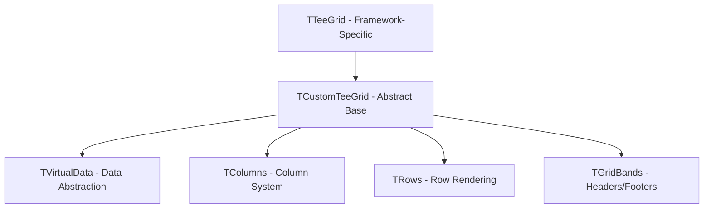
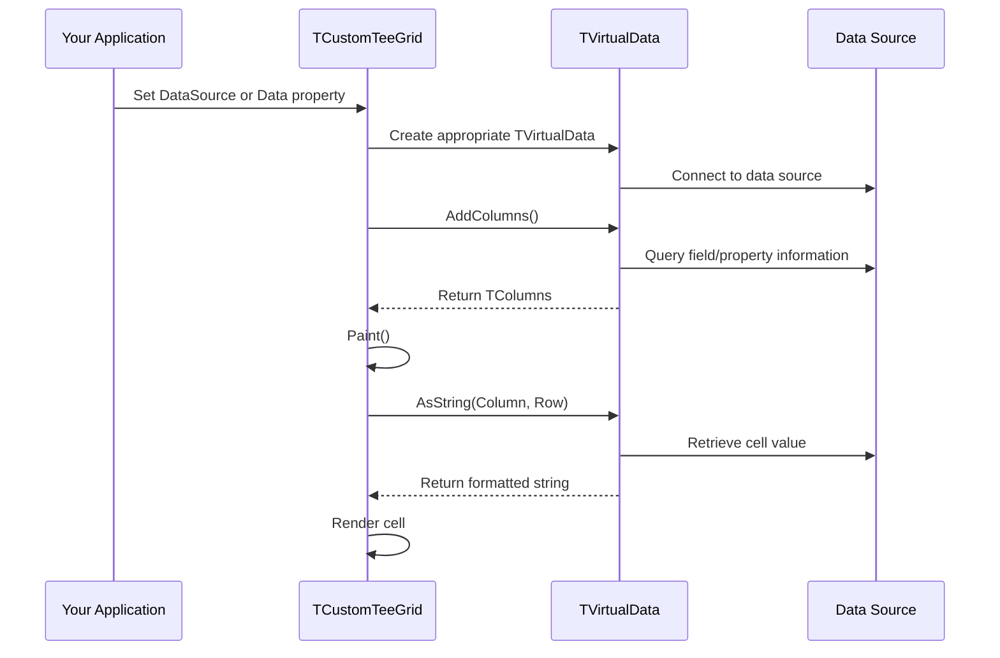

## Overview

TeeGrid is built on a flexible, framework-agnostic architecture that separates the visual grid component from its data source. This design allows TeeGrid to work seamlessly across VCL, FireMonkey, and Lazarus frameworks.

## Core Architecture

The TeeGrid architecture consists of three main layers:



## TCustomTeeGrid: The Core Class

`TCustomTeeGrid` is the abstract base class that defines all grid functionality. It's located in `Tee.Grid.pas` and serves as the foundation for framework-specific implementations.

### Key Properties

<ParamField path="Data" type="TVirtualData">
  The data source for the grid. This property connects your data to the grid through the virtual data abstraction layer.
</ParamField>

<ParamField path="Columns" type="TColumns">
  Collection of grid columns that define the structure and appearance of your data.
</ParamField>

<ParamField path="Rows" type="TRows">
  Controls row rendering, including height, spacing, alternating colors, and cell hover effects.
</ParamField>

<ParamField path="Root" type="TRowGroup">
  The main row group that manages the primary data display and potential hierarchical sub-groups.
</ParamField>

<ParamField path="Selected" type="TGridSelection">
  Manages cell selection state, including single cell and range selection.
</ParamField>

### Component Hierarchy

The grid is composed of several key components:

<AccordionGroup>
  <Accordion title="TRowGroup - Data Grouping" icon="layer-group">
    `TRowGroup` manages a set of rows with associated data and columns. It supports:
    - Main data display through the `Root` property
    - Hierarchical data with expandable sub-groups
    - Independent scrolling and selection within each group
  </Accordion>

  <Accordion title="TGridBands - Header/Footer Areas" icon="rectangle-history">
    `TGridBands` defines horizontal bands that appear above or below the rows:
    - Column headers (via `Header` property)
    - Custom header bands (via `Headers` collection)
    - Footer bands for summaries or additional information
    - Each band can display text, custom renders, or nested sub-bands
  </Accordion>

  <Accordion title="TIndicator - Row State Display" icon="arrow-right">
    `TIndicator` is a special column that appears on the left side:
    - Shows current row selection with a triangle symbol
    - Displays edit/insert state
    - Configurable width through `Indicator.Width` property
  </Accordion>
</AccordionGroup>

## Framework-Specific Implementations

TeeGrid provides concrete implementations for different frameworks:

### VCL: VCLTee.Grid

```pascal
uses VCLTee.Grid;

var
  Grid: TTeeGrid;
begin
  Grid := TTeeGrid.Create(Self);
  Grid.Parent := Self;
  // VCL-specific properties and behavior
end;
```

### FireMonkey: FMXTee.Grid

```pascal
uses FMXTee.Grid;

var
  Grid: TTeeGrid;
begin
  Grid := TTeeGrid.Create(Self);
  Grid.Parent := Self;
  // FMX-specific properties and behavior
end;
```

### Lazarus: LCLTee.Grid

```pascal
uses LCLTee.Grid;

var
  Grid: TTeeGrid;
begin
  Grid := TTeeGrid.Create(Self);
  Grid.Parent := Self;
  // LCL-specific properties and behavior
end;
```

## Rendering Pipeline

The grid uses an abstract painting system through the `TPainter` class, which provides framework-agnostic drawing operations:

<Steps>
  <Step title="Layout Calculation">
    The grid calculates column widths, row heights, and positions for all visible elements.
  </Step>
  
  <Step title="Band Rendering">
    Header and footer bands are rendered first, establishing the available space for rows.
  </Step>
  
  <Step title="Row Rendering">
    Visible rows are painted using the `TRows` component, which:
    - Applies alternating row colors if configured
    - Renders each cell using the column's render settings
    - Highlights selected cells
    - Shows hover effects
  </Step>
  
  <Step title="Custom Painting">
    Custom renderers and event handlers can override default painting behavior at the column or cell level.
  </Step>
</Steps>

## Data Flow

Understanding how data flows through TeeGrid is crucial:



## Key Design Patterns

### Abstract Data Pattern

TeeGrid uses the `TVirtualData` abstract class to decouple the grid from specific data sources. This enables:
- Support for any data source through custom implementations
- Lazy data loading for large datasets
- Virtual mode with on-demand cell value retrieval

### Component-Based Rendering

All visual elements inherit from `TRender`, providing:
- Consistent formatting through `TFormat` (brush, stroke, font)
- Custom painting via render classes
- Reusable visual components across different grid parts

### Event-Driven Updates

The grid uses event notifications to stay synchronized:
- `OnRefresh`: Data source structure changed
- `OnRepaint`: Visual update needed
- `OnChangeRow`: Current row changed
- `OnEditing`: Edit mode started/stopped

## State Management

TeeGrid maintains several state properties:

<CardGroup cols={2}>
  <Card title="Selection State" icon="hand-pointer">
    - Current column and row
    - Selection range (if enabled)
    - Unfocused selection appearance
  </Card>
  
  <Card title="Editing State" icon="pen-to-square">
    - Active editor control
    - Edit mode (insert/edit)
    - Modified cell values
  </Card>
  
  <Card title="Scroll State" icon="arrows-up-down">
    - Horizontal scroll position
    - Vertical scroll position
    - First visible row index
  </Card>
  
  <Card title="Layout State" icon="table-cells">
    - Calculated column positions
    - Row heights (if custom)
    - Expanded/collapsed groups
  </Card>
</CardGroup>

## Thread Safety and Updates

<Warning>
TeeGrid is not thread-safe. All grid operations must occur on the main UI thread. Use thread synchronization when updating grid data from background threads.
</Warning>

To refresh the grid after data changes:

```pascal
// Refresh the entire grid
TeeGrid1.RefreshData;

// Repaint without reloading data
TeeGrid1.Invalidate;
```

## Memory Management

<Note>
TeeGrid follows standard Delphi component ownership rules. The grid owns its columns, bands, and internal objects. When you assign a `TVirtualData` instance, set its ownership appropriately.
</Note>

```pascal
var
  MyData: TVirtualDBData;
begin
  MyData := TVirtualDBData.From(DataSource1);
  TeeGrid1.Data := MyData;
  // MyData is now owned by TeeGrid1
end;
```

## Next Steps

<CardGroup cols={2}>
  <Card title="Data Binding" icon="database" href="/concepts/data-binding">
    Learn how to connect your data to TeeGrid
  </Card>
  
  <Card title="Column System" icon="table-columns" href="/concepts/columns">
    Understand the column hierarchy and configuration
  </Card>
  
  <Card title="Virtual Data" icon="layer-group" href="/concepts/virtual-data">
    Deep dive into the data abstraction layer
  </Card>
  
  <Card title="API Reference" icon="code" href="/api/customteegrid">
    Explore the complete API documentation
  </Card>
</CardGroup>
