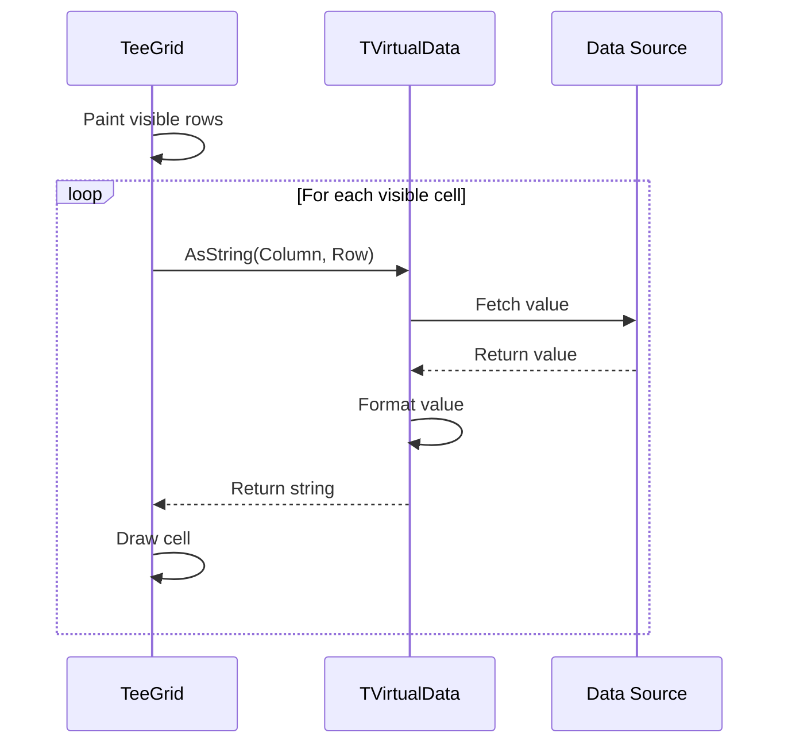

## The Virtual Data Pattern

TeeGrid's `TVirtualData` class implements a virtual data pattern that decouples the grid's rendering engine from the underlying data source. This design provides several key benefits:

<CardGroup cols={2}>
  <Card title="Data Source Flexibility" icon="database">
    Support any data source by implementing a single interface
  </Card>
  
  <Card title="Lazy Loading" icon="clock">
    Retrieve only visible cells on-demand for optimal performance
  </Card>
  
  <Card title="Large Datasets" icon="chart-simple">
    Handle millions of rows without loading all data into memory
  </Card>
  
  <Card title="Framework Agnostic" icon="layer-group">
    Same data adapter works across VCL, FMX, and Lazarus
  </Card>
</CardGroup>

## How Virtual Data Works

The virtual data pattern operates on a simple principle: **the grid never holds the actual data**.



### Key Characteristics

<Steps>
  <Step title="On-Demand Retrieval">
    Values are fetched only when needed for display, not preloaded into memory.
  </Step>
  
  <Step title="No Data Duplication">
    The grid holds no copy of your data - it queries the virtual data adapter each time.
  </Step>
  
  <Step title="Efficient Updates">
    When data changes, notify the grid via events rather than transferring data.
  </Step>
  
  <Step title="Streaming Support">
    Data sources without a known row count work perfectly (return -1 from `Count()`).
  </Step>
</Steps>

## TVirtualData Abstract Class

Defined in `Tee.GridData.pas`, this class establishes the contract for all data adapters:

### Required Methods

Every TVirtualData implementation must provide:

<ResponseField name="Count" type="Integer">
  Returns the total number of rows. Return -1 if unknown (streaming data).
  
  ```pascal
  function Count: Integer; virtual; abstract;
  ```
</ResponseField>

<ResponseField name="AsString" type="String">
  Retrieves the display value for a specific cell. This is the most performance-critical method.
  
  ```pascal
  function AsString(const AColumn: TColumn; const ARow: Integer): String; virtual; abstract;
  ```
</ResponseField>

<ResponseField name="AddColumns" type="procedure">
  Populates the columns collection based on the data structure.
  
  ```pascal
  procedure AddColumns(const AColumns: TColumns); virtual; abstract;
  ```
</ResponseField>

<ResponseField name="Load" type="procedure">
  Associates manually-defined columns with data source fields.
  
  ```pascal
  procedure Load(const AColumns: TColumns); virtual; abstract;
  ```
</ResponseField>

<ResponseField name="SetValue" type="procedure">
  Updates a cell value when the user edits it.
  
  ```pascal
  procedure SetValue(const AColumn: TColumn; const ARow: Integer; const AText: String); virtual; abstract;
  ```
</ResponseField>

<ResponseField name="AutoWidth" type="Single">
  Calculates the optimal width for a column based on its content.
  
  ```pascal
  function AutoWidth(const APainter: TPainter; const AColumn: TColumn): Single; virtual; abstract;
  ```
</ResponseField>

### Optional Override Methods

<AccordionGroup>
  <Accordion title="AsFloat" icon="hashtag">
    ```pascal
    function AsFloat(const AColumn: TColumn; const ARow: Integer): TFloat; virtual;
    ```
    Returns numeric values for calculations and sorting. Default implementation converts `AsString` result.
  </Accordion>
  
  <Accordion title="AutoHeight" icon="ruler-vertical">
    ```pascal
    function AutoHeight(const APainter: TPainter; const AColumn: TColumn; 
      const ARow: Integer; out AHeight: Single): Boolean; virtual;
    ```
    Calculates custom row height. Return `True` if implemented, `False` to use default height.
  </Accordion>
  
  <Accordion title="CanExpand" icon="plus-square">
    ```pascal
    function CanExpand(const Sender: TRender; const ARow: Integer): Boolean; virtual;
    ```
    Indicates whether a row can be expanded to show detail data.
  </Accordion>
  
  <Accordion title="GetDetail" icon="sitemap">
    ```pascal
    function GetDetail(const ARow: Integer; const AColumns: TColumns; 
      out AParent: TColumn): TVirtualData; virtual;
    ```
    Returns a TVirtualData instance for detail rows in master-detail scenarios.
  </Accordion>
  
  <Accordion title="CanSortBy" icon="arrow-down-a-z">
    ```pascal
    function CanSortBy(const AColumn: TColumn): Boolean; virtual;
    ```
    Returns `True` if the column supports sorting.
  </Accordion>
  
  <Accordion title="SortBy" icon="sort">
    ```pascal
    procedure SortBy(const AColumn: TColumn); virtual;
    ```
    Implements sorting logic for the specified column.
  </Accordion>
  
  <Accordion title="IsSorted" icon="check">
    ```pascal
    function IsSorted(const AColumn: TColumn; out Ascending: Boolean): Boolean; virtual;
    ```
    Returns current sort state for a column.
  </Accordion>
  
  <Accordion title="ReadOnly" icon="lock">
    ```pascal
    function ReadOnly(const AColumn: TColumn): Boolean; virtual;
    ```
    Returns `True` if the column is read-only. Default returns `False`.
  </Accordion>
  
  <Accordion title="DataType" icon="tag">
    ```pascal
    function DataType(const AColumn: TColumn): PTypeInfo; virtual;
    ```
    Returns type information for better formatting and editing.
  </Accordion>
</AccordionGroup>

## Built-in Implementations

TeeGrid provides three production-ready TVirtualData implementations:

### TVirtualDBData (Tee.GridData.DB)

Connects to TDataSet and TDataSource components.

**Key Features:**
- Automatic field-to-column mapping
- Full edit support with Post/Cancel
- Native data type handling
- Bookmark-based navigation
- Master-detail relationships
- Fetch mode configuration (All, Partial, Automatic)

**Internal Architecture:**

```pascal
TVirtualDBData
  ├─ IDataSet: TDataSet          // Target dataset
  ├─ IDataSource: TDataSource    // Optional datasource
  └─ ILink: TVirtualDataLink     // TDataLink descendant
       ├─ Monitors dataset state
       ├─ Responds to data changes
       └─ Triggers grid refresh
```

**Data Retrieval:**

```pascal
function TVirtualDBData.AsString(const AColumn: TColumn; const ARow: Integer): String;
var
  RecNo: Integer;
  Field: TField;
begin
  RecNo := BeginRow(ARow);  // Navigate to row
  try
    Field := FieldOf(AColumn);
    Result := Field.DisplayText;
  finally
    EndRow(RecNo);  // Restore position
  end;
end;
```

### TVirtualData&lt;T&gt; (Tee.GridData.Rtti)

Generic adapter using RTTI for arrays, lists, and objects.

**Supported Types:**
- `TArray<T>` - Static arrays
- `TList<T>` - Generic lists
- `TObjectList<T>` - Object lists
- Single records/objects
- 2D arrays (`TArray<TArray<T>>`)

**RTTI-Based Column Creation:**

```pascal
procedure TVirtualDataRtti.AddColumns(const AColumns: TColumns);
var
  RttiType: TRttiType;
  Member: TRttiMember;
  Column: TColumn;
begin
  RttiType := Context.GetType(FTypeInfo);
  
  // Iterate fields and properties
  for Member in RttiType.GetFields + RttiType.GetProperties do
    if IsVisible(Member) then  // Check visibility level
    begin
      Column := AColumns.Add;
      Column.Header.Text := Member.Name;
      LinkTo(Column, Member, TypeOf(Member));
    end;
end;
```

**Value Access:**

```pascal
function TVirtualData<T>.AsString(const AColumn: TColumn; const ARow: Integer): String;
var
  Value: TValue;
  Member: TRttiMember;
  P: Pointer;
begin
  P := GetPointerOf(AColumn, ARow);  // Get data pointer
  Member := MemberOf(AColumn);        // Get RTTI member
  Value := ValueOf(Member, P);        // Read value via RTTI
  Result := Value.ToString;           // Convert to string
end;
```

**Helper Classes:**

```pascal
// Convenient aliases
TVirtualArrayData<T> = class(TVirtualData<TArray<T>>);
TVirtualListData<T> = class(TVirtualData<TList<T>>);
TVirtualObjectListData<T:class> = class(TVirtualData<TObjectList<T>>);
```

### TVirtualStringData (Tee.GridData.Strings)

String grid emulation with `Cells[Col, Row]` indexing.

**Usage:**

```pascal
var
  Data: TVirtualStringData;
begin
  Data := TVirtualStringData.Create;
  Data.RowCount := 100;
  Data.Columns.Add('Name');
  Data.Columns.Add('Value');
  
  Data.Cells[0, 0] := 'First Cell';
  Data.Cells[1, 0] := 'Second Cell';
  
  TeeGrid1.Data := Data;
end;
```

## Creating Custom Virtual Data

Implementing a custom adapter requires careful attention to performance and correctness.

### Basic Implementation Template

```pascal
unit MyVirtualData;

interface

uses
  Tee.GridData, Tee.Grid.Columns, Tee.Painter;

type
  TMyVirtualData = class(TVirtualData)
  private
    FDataSource: TMyDataSource;
  protected
    function Empty: Boolean; override;
    function KnownCount: Boolean; override;
  public
    constructor Create(ADataSource: TMyDataSource);
    
    procedure AddColumns(const AColumns: TColumns); override;
    function AsString(const AColumn: TColumn; const ARow: Integer): String; override;
    function AutoWidth(const APainter: TPainter; const AColumn: TColumn): Single; override;
    function Count: Integer; override;
    procedure Load(const AColumns: TColumns); override;
    procedure SetValue(const AColumn: TColumn; const ARow: Integer; const AText: String); override;
  end;

implementation

constructor TMyVirtualData.Create(ADataSource: TMyDataSource);
begin
  inherited Create;
  FDataSource := ADataSource;
end;

function TMyVirtualData.Empty: Boolean;
begin
  Result := (FDataSource = nil) or (FDataSource.RecordCount = 0);
end;

function TMyVirtualData.KnownCount: Boolean;
begin
  // Return True if Count is known, False for streaming data
  Result := True;
end;

function TMyVirtualData.Count: Integer;
begin
  if FDataSource = nil then
    Result := 0
  else
    Result := FDataSource.RecordCount;
end;

function TMyVirtualData.AsString(const AColumn: TColumn; const ARow: Integer): String;
var
  FieldName: string;
begin
  // Extract field identifier from TagObject
  FieldName := TMyField(AColumn.TagObject).Name;
  
  // Retrieve value from data source
  Result := FDataSource.GetValue(FieldName, ARow);
end;

procedure TMyVirtualData.AddColumns(const AColumns: TColumns);
var
  I: Integer;
  Col: TColumn;
  Field: TMyField;
begin
  AColumns.Clear;
  
  for I := 0 to FDataSource.FieldCount - 1 do
  begin
    Field := FDataSource.Fields[I];
    Col := AColumns.Add;
    Col.Header.Text := Field.DisplayName;
    Col.TagObject := Field;  // Store field reference
    
    // Set alignment based on field type
    if Field.IsNumeric then
    begin
      Col.TextAlignment := TColumnTextAlign.Custom;
      Col.TextAlign.Horizontal := THorizontalAlign.Right;
    end;
  end;
end;

procedure TMyVirtualData.Load(const AColumns: TColumns);
var
  I: Integer;
  Field: TMyField;
begin
  // Associate existing columns with fields
  for I := 0 to AColumns.Count - 1 do
  begin
    Field := FDataSource.FindField(AColumns[I].Header.Text);
    if Field <> nil then
      AColumns[I].TagObject := Field;
  end;
end;

function TMyVirtualData.AutoWidth(const APainter: TPainter; const AColumn: TColumn): Single;
var
  I: Integer;
  S: String;
  W: Single;
begin
  Result := 0;
  
  // Sample first 100 rows for width calculation
  for I := 0 to Min(99, Count - 1) do
  begin
    S := AsString(AColumn, I);
    W := APainter.TextWidth(S);
    if W > Result then
      Result := W;
  end;
  
  // Add padding
  Result := Result + 20;
end;

procedure TMyVirtualData.SetValue(const AColumn: TColumn; const ARow: Integer; const AText: String);
var
  Field: TMyField;
begin
  Field := TMyField(AColumn.TagObject);
  FDataSource.SetValue(Field.Name, ARow, AText);
  
  // Notify grid of change
  Repaint;
end;

end.
```

### Performance Optimization

<Tabs>
  <Tab title="AsString Optimization">
    `AsString` is called for every visible cell on every paint. Optimize it ruthlessly:
    
    ```pascal
    // BAD - slow
    function AsString(const AColumn: TColumn; const ARow: Integer): String;
    begin
      Result := Format('%.2f', [CalculateComplexValue(ARow)]);
    end;
    
    // GOOD - cache results
    function AsString(const AColumn: TColumn; const ARow: Integer): String;
    begin
      if not FCache.TryGetValue(ARow, Result) then
      begin
        Result := Format('%.2f', [CalculateComplexValue(ARow)]);
        FCache.Add(ARow, Result);
      end;
    end;
    ```
  </Tab>
  
  <Tab title="Count Caching">
    Cache the count if it's expensive to calculate:
    
    ```pascal
    private
      FCount: Integer;
      FCounted: Boolean;
    
    function Count: Integer;
    begin
      if not FCounted then
      begin
        FCount := ExpensiveCountCalculation;
        FCounted := True;
      end;
      Result := FCount;
    end;
    
    procedure Refresh;
    begin
      FCounted := False;  // Invalidate cache
      inherited;
    end;
    ```
  </Tab>
  
  <Tab title="AutoWidth Sampling">
    Don't scan all rows for width calculation:
    
    ```pascal
    function AutoWidth(const APainter: TPainter; const AColumn: TColumn): Single;
    const
      SampleSize = 100;
    var
      I, Step: Integer;
      S: String;
      W: Single;
    begin
      Result := 0;
      
      if Count <= SampleSize then
        Step := 1
      else
        Step := Count div SampleSize;
      
      I := 0;
      while I < Count do
      begin
        S := AsString(AColumn, I);
        W := APainter.TextWidth(S);
        if W > Result then
          Result := W;
        Inc(I, Step);
      end;
    end;
    ```
  </Tab>
</Tabs>

### Data Change Notifications

Use events to notify the grid of changes:

```pascal
procedure TMyVirtualData.DataSourceChanged;
begin
  // Structure changed (columns added/removed)
  Refresh;  // Calls FOnRefresh
end;

procedure TMyVirtualData.DataSourceModified;
begin
  // Values changed but structure same
  Repaint;  // Calls FOnRepaint
end;

procedure TMyVirtualData.CurrentRowChanged(ARow: Integer);
begin
  // Current row changed
  ChangeSelectedRow(ARow);  // Calls FOnChangeRow
end;
```

## Advanced Features

### Master-Detail Support

```pascal
function TMyVirtualData.HasDetail(const ARow: Integer): Boolean;
begin
  Result := FDataSource.HasDetailRecords(ARow);
end;

function TMyVirtualData.GetDetail(const ARow: Integer; const AColumns: TColumns; 
  out AParent: TColumn): TVirtualData;
var
  DetailData: TMyDataSource;
begin
  DetailData := FDataSource.GetDetailDataSource(ARow);
  Result := TMyVirtualData.Create(DetailData);
  AParent := nil;  // Or specify which column triggers expansion
end;
```

### Custom Sorting

```pascal
function TMyVirtualData.CanSortBy(const AColumn: TColumn): Boolean;
begin
  Result := True;  // All columns sortable
end;

procedure TMyVirtualData.SortBy(const AColumn: TColumn);
var
  Field: TMyField;
  Ascending: Boolean;
begin
  Field := TMyField(AColumn.TagObject);
  
  // Toggle sort direction
  if IsSorted(AColumn, Ascending) then
    Ascending := not Ascending
  else
    Ascending := True;
  
  FDataSource.Sort(Field.Name, Ascending);
  Refresh;
end;

function TMyVirtualData.IsSorted(const AColumn: TColumn; out Ascending: Boolean): Boolean;
var
  Field: TMyField;
begin
  Field := TMyField(AColumn.TagObject);
  Result := FDataSource.IsSorted(Field.Name, Ascending);
end;
```

### Column Calculations

```pascal
// Built-in calculation support
var
  Total: Double;
begin
  Total := TeeGrid1.Data.Calculate(TeeGrid1.Columns[2], TColumnCalculation.Sum);
  Average := TeeGrid1.Data.Calculate(TeeGrid1.Columns[2], TColumnCalculation.Average);
end;

// Implement in your TVirtualData:
function Calculate(const AColumn: TColumn; const ACalculation: TColumnCalculation): TFloat;
var
  I: Integer;
  Value: TFloat;
begin
  case ACalculation of
    TColumnCalculation.Sum:
      begin
        Result := 0;
        for I := 0 to Count - 1 do
          Result := Result + AsFloat(AColumn, I);
      end;
    // ... other calculations
  end;
end;
```

## Testing Virtual Data

```pascal
procedure TestMyVirtualData;
var
  Data: TMyVirtualData;
  Columns: TColumns;
  S: String;
begin
  Data := TMyVirtualData.Create(MyDataSource);
  try
    // Test column creation
    Columns := TColumns.Create(nil, TColumn);
    try
      Data.AddColumns(Columns);
      Assert(Columns.Count > 0, 'No columns created');
      
      // Test data retrieval
      if Data.Count > 0 then
      begin
        S := Data.AsString(Columns[0], 0);
        Assert(S <> '', 'Empty value returned');
      end;
      
      // Test edit
      Data.SetValue(Columns[0], 0, 'Test');
      S := Data.AsString(Columns[0], 0);
      Assert(S = 'Test', 'Value not updated');
    finally
      Columns.Free;
    end;
  finally
    Data.Free;
  end;
end;
```

## Best Practices

<AccordionGroup>
  <Accordion title="Memory Management" icon="memory">
    - Store only essential state in TVirtualData
    - Let the original data source own the actual data
    - Clear caches in `Refresh` method
    - Don't store TColumn references (they can be freed/recreated)
  </Accordion>
  
  <Accordion title="Error Handling" icon="triangle-exclamation">
    - Protect against invalid row/column indices
    - Handle data source disconnection gracefully
    - Return empty string from AsString on errors (don't raise)
    - Raise exceptions only in SetValue for validation errors
  </Accordion>
  
  <Accordion title="Thread Safety" icon="lock">
    - TVirtualData methods are called from UI thread only
    - If data source uses background threads, synchronize access
    - Use critical sections for shared state
  </Accordion>
  
  <Accordion title="Type Information" icon="info">
    - Implement DataType() for proper formatting and editors
    - Use TagObject to store field/property references
    - Return appropriate THorizontalAlign for column types
  </Accordion>
</AccordionGroup>

## Next Steps

<CardGroup cols={2}>
  <Card title="Data Binding" icon="link" href="/concepts/data-binding">
    Understanding the data binding architecture
  </Card>
  
  <Card title="Custom Data Source" icon="code" href="/data/custom-virtual-data">
    Complete guide to custom implementations
  </Card>
  
  <Card title="Database Grids" icon="database" href="/data/datasets">
    Working with TVirtualDBData
  </Card>
  
  <Card title="API Reference" icon="book" href="/api/virtualdata">
    Full TVirtualData API documentation
  </Card>
</CardGroup>
